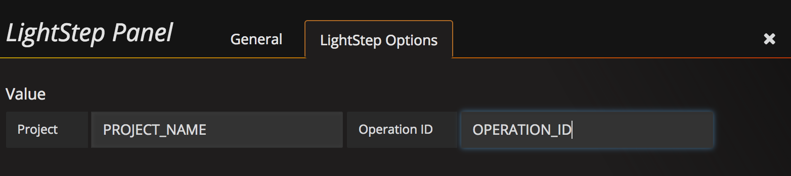

# LightStep Grafana plugin

## Installation

Grafana 4 or newer is required for use the LightStep panel.

To install the plugin, copy the contents of the git repository to your plugins directory. The default on Linux systems is `/var/lib/grafana/plugins`.  Depending on your setup, you may need to restart your Grafana instance after the plug-in is installed.

If installation was successful, you should see something like the below:

## Usage

**NOTE:** *in order for the embedded graphs to display, you must be logged into LightStep in your browser.*

### Adding a LightStep Panel

### Update the panel JSON

There are two required parameters that need to be set in the panel JSON:

* **Project name**
* **ID of the operation or saved search**.

Edit the panel in Grafana and enter the LightStep Options:

