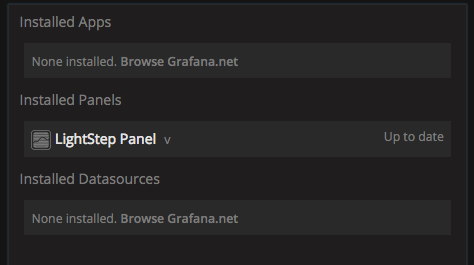
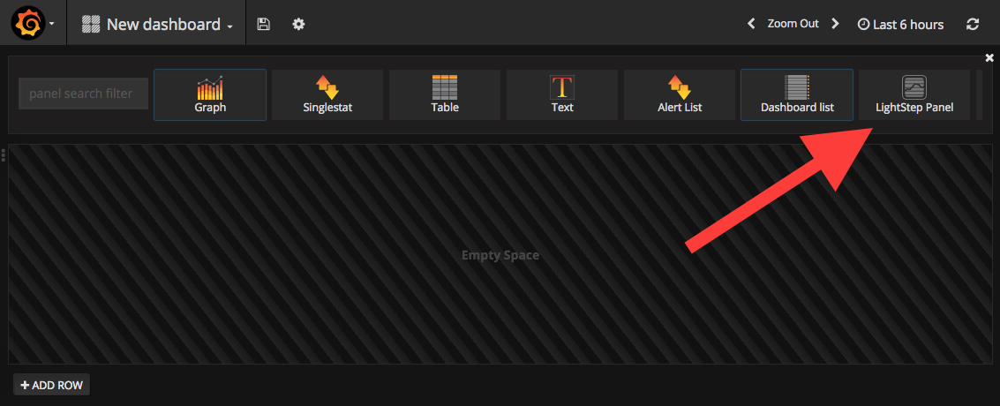
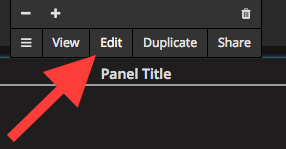
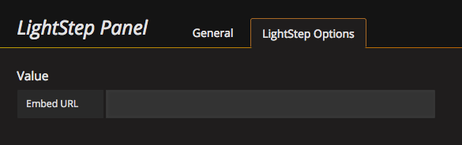
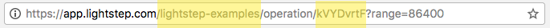

# LightStep Grafana plugin

* [Installation](#installation)
* [Usage](#usage)

## Installation

Grafana 3.1.0 or later is required for use the LightStep panel.

To install the plugin, copy the contents of the git repository to your plugins directory. The default on Linux systems is `/var/lib/grafana/plugins`.  Depending on your setup, you may need to restart your Grafana instance after the plug-in is installed.

If installation was successful, you should see something like the below:



## Usage

**NOTE:** *in order for the embedded graphs to display, you must be logged into LightStep in your browser.*

#### Adding a LightStep Panel

Once the LightStep plug-in has been installed, the LightStep Panel should be available as an option when editing your dashboard.



Once the panel is added, click on the panel title and choose "Edit."



Click on the "LightStep Options" tab and copy in the embed URL, as provided in LightStep, into the given field.




#### Advanced usage: setting the options via JSON

The above options may be set directly via editing the panel JSON, either via the Grafana UI or via programmatically generated panels. The minimal JSON would look something like the below (with JSON values below for `operationID` and `project` swapped out appropriately with the desired values).

```json
{
  "type": "lightstep-panel",
  "operationID": "OPERATION_ID",
  "project": "PROJECT_NAME"
}
```

This information can be found within LightStep in the URL of the chart you wish to add:


